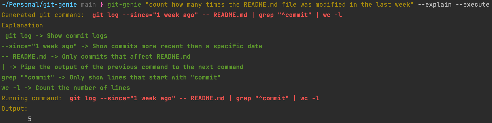

# git-genie 🧞

Generate & explain git commands using plain english.

### Generate commit messages based on staged changes

```shell
❯ git-genie commit

Generated command: git commit -m 'Update README with commit message example and instructions'
```

### Generate & Explain complex git commands using plain english



## Installation

```bash
pip install git-genie
```

## Usage

`❯ git-genie [OPTIONS] INSTRUCTION`

For example:

```bash
❯ git-genie --explain "Who was the last person to modify the README.md file?"
```

Options:

- `--explain`, `-e`: Explain the generated git command automatically.
- `--execute`, `-x`: Execute the generated git command automatically.
- `--install-completion`: Install completion for the current shell.
- `--show-completion`: Show completion for the current shell, to copy it or customize the installation.
- `--help`, `-h`: Show this message and exit.

If no options are provided, the program will run in interactive mode.

Optionally, you can add a "gg" alias to your shell's rc file (e.g. ~/.bashrc) to make the command shorter:

```bash
alias gg="git-genie"
```

### Pre-requisites

#### OpenAI API key

```shell
export OPENAI_API_KEY=sk-xxxxxxxxxxxxxxxxxxxxxxxxxxxxxxxxxxxxxxxx
```

### Generate commit messages

Generating commit messages is done by using the `commit` command.
This method will create a concise message based on the changes staged for a commit.

```bash
❯ git status

Changes to be committed:
  (use "git restore --staged <file>..." to unstage)
        modified:   README.md
```

Let's generate a commit message for the changed README.md file:

```bash
❯ git-genie commit
Generated commit command:git commit -m 'Update README with commit message example and instructions'
(E)xplain or e(X)ecute or (N)ew?: X
```

By pressing `X`, the generated commit command will be executed automatically:

```bash
Running command: git commit -m 'Update README with commit message example and instructions'
Output:
[commit_gen 75d69ce] Update README with commit message example and instructions
 1 file changed, 19 insertions(+)
```

### Interactive mode

By default, the program will run in interactive mode, where it will ask you if you would like to explain the generated
git command, execute it, or generate a new command.

```bash
~/git-genie ❯ git-genie "count how many times the README.md file was modified in the last week"

Generated git command: git log --since=1.week -- README.md | grep "^commit" | wc -l

(E)xplain or e(X)ecute or (N)ew?: E

Explanation
 git log -> Show commit logs
--since=1.week -> Show commits more recent than a specific date
-- README.md -> Only commits that affect README.md
| -> Pipe the output of the previous command to the next command
grep "^commit" -> Only show lines that start with "commit"
wc -l -> Count the number of lines

e(X)ecute or (N)ew?: X

Running command:  git log --since=1.week -- README.md | grep "^commit" | wc -l
Output:
       2
```

### Non-interactive mode

#### Explain

By using the `--explain` flag, the program will print the explanation of the generated git command.

```bash
~/git-genie ❯ git-genie "amend all previous commits with new email address" --explain

Generated git command:  git rebase -i HEAD~5 --autosquash -m "legacy code"

Explanation

 git rebase -> Forward-port local commits to the updated upstream head
-i, --interactive -> Make a list of the commits which are about to be rebased.Let the user edit that list before rebasing.
--autosquash -> Automatically move commits that begin with squash!/fixup! to the beginningof the todo list.
-m, --merge -> Use the given message as the merge commit message.If multiple -m options are given, their values are concatenated as separate paragraphs.
HEAD~5 -> The last 5 commits
legacy code -> The message of the merge commit
```

#### Execute

By using the `--execute` flag, the program will execute the generated git command automatically without asking for
confirmation.

```bash
~/git-genie ❯ git-genie "print last 5 commits logs, condensed" --execute

Generated git command:  git log -5 --oneline

Running command:  git log -5 --oneline

Output:
9a33bc3 update email
f76f041 CLI interface
ae8abbd Add pycache to gitignore
67169fd rich print
3bac238 Refactor
```
